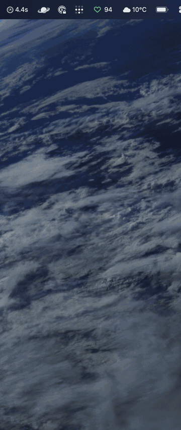
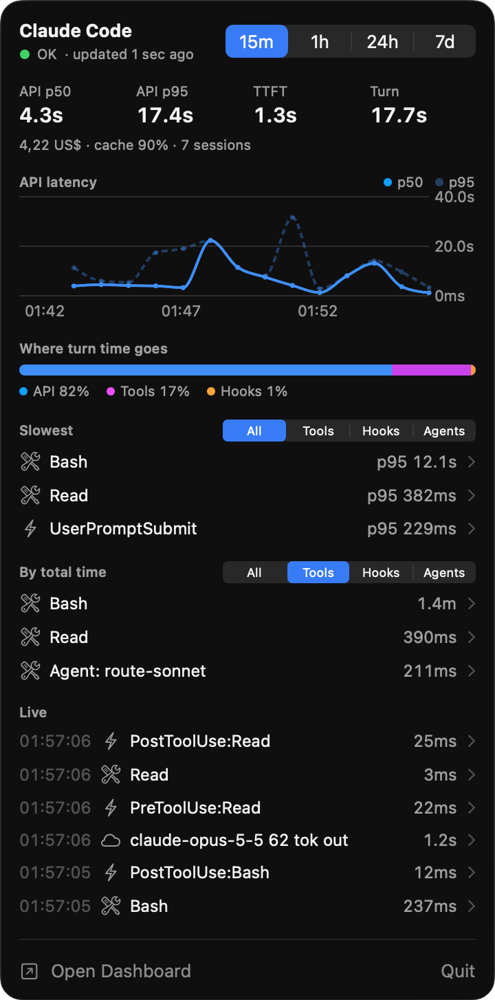
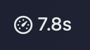

<h1 align="center">Claude Performance Analyzer</h1>

<p align="center">
  <strong>See where your Claude Code turns spend their time.</strong><br>
  Model latency, tools, hooks, skills, subagents and MCP startup, live in your macOS menu bar.
</p>

<p align="center">
  
  
  
  
  <a href="LICENSE"></a>
</p>

<p align="center">
  
  <br>
  <sub><a href="docs/screenshots/menubar-demo.mp4">Watch the demo in full quality (MP4)</a></sub>
</p>

---

## Why

A slow Claude Code turn can come from many places: the model, a long Bash call, a hook that runs on every prompt, an MCP server that takes seconds to connect. Claude Code already reports all of this through OpenTelemetry. Claude Performance Analyzer collects that data on your machine and turns it into answers:

- Is the model slow right now, or is it my setup?
- Which hook adds time to every prompt?
- Which tools, skills and subagents eat the most time?
- What did this session cost, and how well is the prompt cache working?

## Features

- **Glanceable menu bar label.** API p50 latency over the last 15 minutes. It turns into a warning triangle when hooks are slow.
- **Native SwiftUI panel.** Headline numbers, a latency chart, the API, tools and hooks split, and ranked lists, in 15m, 1h, 24h or 7d windows.
- **Drill-down detail cards.** Click any row to see its count, failures, p50, p95 and max, a split by repository, and recent calls.
- **Live feed.** Hook, tool and model events as they arrive, within a few seconds.
- **Web dashboard.** Turn waterfall, recent prompts, skills, subagents, models, permission decisions, MCP connect times, errors and compaction.
- **One-click setup.** The dashboard adds the needed telemetry variables to `~/.claude/settings.json`, keeps your existing values and writes a backup first.
- **Private by design.** The collector listens on `127.0.0.1` only. Data stays in a local SQLite file for 14 days.

## Quick start

**Requirements:** macOS 14 or later, [Bun](https://bun.sh), and Xcode Command Line Tools (`xcode-select --install`).

```bash
git clone https://github.com/kolezka/claude-performance-analyzer.git
cd claude-performance-analyzer
bun install
bun run start      # collector and dashboard on http://127.0.0.1:4318
bun run app        # build and open the menu bar app
```

Then connect Claude Code. Open http://127.0.0.1:4318 and use the setup button, or add these to the `env` block of `~/.claude/settings.json` yourself:

```bash
CLAUDE_CODE_ENABLE_TELEMETRY=1
OTEL_LOGS_EXPORTER=otlp
OTEL_METRICS_EXPORTER=otlp
OTEL_EXPORTER_OTLP_PROTOCOL=http/json      # http/protobuf works too; grpc does not
OTEL_EXPORTER_OTLP_ENDPOINT=http://127.0.0.1:4318
OTEL_LOGS_EXPORT_INTERVAL=1000            # how "real time" the live feed is
OTEL_LOG_TOOL_DETAILS=1                 # real skill, MCP and subagent names
CLAUDE_CODE_ENHANCED_TELEMETRY_BETA=1   # optional: time to first token, turn spans
OTEL_TRACES_EXPORTER=otlp
```

Start a new Claude Code session. Only sessions started after this point are recorded.

## The menu bar app





The **label** shows API p50 latency over the last 15 minutes and refreshes every 2 seconds. Hooks count as slow when they take more than 15% of in-turn time, or when one hook has a p95 above 2s. Then the gauge changes to a warning triangle.

Click the label to open the **panel**:

| Section | What it shows |
| --- | --- |
| Header | Time window picker (15m, 1h, 24h, 7d) and collector status |
| Headline numbers | API p50 and p95, time to first token, turn duration, cost, cache hit rate, sessions |
| API latency | p50 and p95 over time |
| Where turn time goes | Split between API, tools and hooks |
| Slowest | Top items by p95, filtered by tools, hooks or agents |
| By total time | Top items by summed duration, with the same filters |
| Live | Latest hook, tool and model events |

The panel polls only while it is open.

**Settings** let you launch at login, pick the default window and the windows in the header, point at another collector URL, tune polling intervals, change the label style, set the panel width and hide any section.

<br clear="right">

## How it works

```
Claude Code ──OTLP──▶ collector (127.0.0.1:4318) ──▶ SQLite
                               │
                               ├── /api/status, /api/summary, /api/live ──▶ menu bar app
                               └── web dashboard
```

Claude Code exports logs, metrics and traces over OTLP. The collector decodes them, stores them in `~/.claude-telemetry/telemetry.sqlite` and serves a small JSON API. The menu bar app and the dashboard both read from that API. Nothing leaves your machine.

## Project layout

Bun workspaces. Each package has its own `src/` and `test/`.

| Path | What it does |
| --- | --- |
| `apps/collector` | Bun OTLP receiver (http/json or http/protobuf, gzip ok) on `127.0.0.1:4318`. Stores to SQLite with 14 day retention. Serves the dashboard and the JSON API. |
| `apps/dashboard` | Svelte web dashboard, bundled by the collector through its HTML import. |
| `apps/menubar` | SwiftUI menu bar app (`MenuBarExtra`), built with `swiftc` into a universal (arm64 and x86_64) `.app`. |
| `packages/otlp` | Decodes OTLP http/json and http/protobuf into rows. |
| `packages/analytics` | Summaries, percentiles, turn timelines. Shared by the collector and the dashboard. |
| `packages/claude-settings` | Adds the telemetry variables to Claude Code's `settings.json`. |

## Development

```bash
bun run dev        # collector in development mode
bun test           # all packages
bun run typecheck
```

A `Makefile` wraps the same commands. Run `make` to list targets.

## Limits

- Only sessions started after telemetry is turned on are recorded. There is no backfill.
- Rules have no timing in telemetry. They only appear as `source: config` permission decisions.
- Hook timing is per hook event and matcher (`PreToolUse:Bash`), not per script. Per-script detail needs detailed beta tracing.
- "Where turn time goes" adds up component durations, so parallel tool calls overlap.

## License

[MIT](LICENSE) © 2026 Mariusz Rakus

`packages/otlp/proto/` holds the OTLP `.proto` definitions from [open-telemetry/opentelemetry-proto](https://github.com/open-telemetry/opentelemetry-proto) v1.11.1, Apache 2.0 (see `packages/otlp/proto/LICENSE`).
